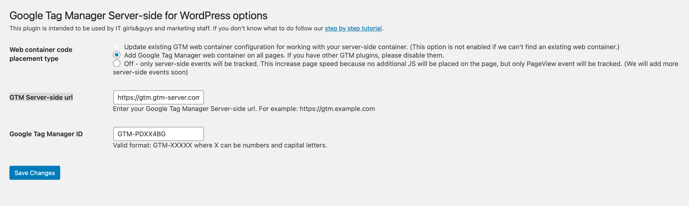
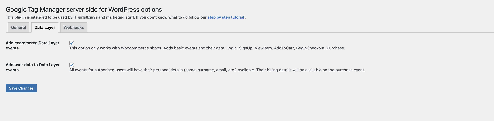
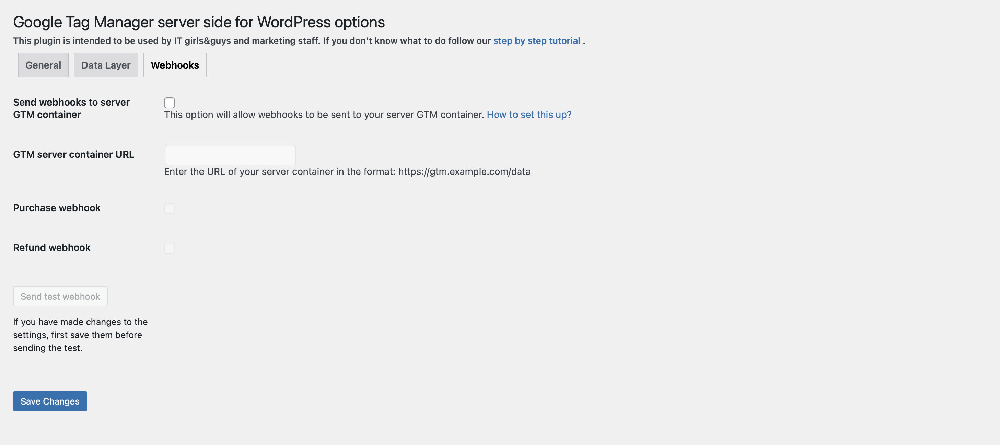

# GTM Server Side Plugin

**Contributors:** gtmserver, bukashk0zzz

**Requires at least:** 5.2.0

**Tested up to:** 6.9.0

**Stable tag:** 2.1.42

**License:** GPLv2 or later

**License URI:** [http://www.gnu.org/licenses/gpl-2.0.html](http://www.gnu.org/licenses/gpl-2.0.html)

**Tags:** Google Tag Manager, Google Tag Manager Server Side, GTM, GTM Server Side, Tag Manager, Analytics, Google, Server-Side, GTag

## Description

The **GTM Server Side** plugin by [stape.io](https://stape.io) is the easiest way to implement server-side tracking on your WordPress website. It allows you to easily modify the GTM script with the tagging server URL, adds a custom loader, and sends Data Layer events and webhooks.

### Features

- Add the Google Tag Manager script to every website page.
- Works with any other WordPress plugin that inserts the GTM script.
- Includes a custom loader to make GTM and Google Analytics tracking invisible to ad blockers and other tracking prevention mechanisms.
- Sends events to the GTM server side without requiring a JavaScript library, improving page speed.
- Adds e-commerce Data Layer events.
- Adds user data to Data Layer events.
- Sends webhooks.

### Benefits

- Increases cookie lifetime when using a custom domain for the server GTM container.
- Improves tracking accuracy when the custom loader is enabled.
- Simplifies GTM script integration and enhances e-commerce and user data tracking.

## Installation

1. Unzip and upload the `gtm-server-side` folder to the `/wp-content/plugins/` directory.
2. Activate the plugin through the **Plugins** menu in WordPress.
3. Go to **Settings > GTM Server Side**, enter your GTM Server Side URL, and configure additional options.

## Frequently Asked Questions

### What is Google Tag Manager?
Refer to the official [Google Tag Manager Documentation](https://marketingplatform.google.com/about/tag-manager/).

### What is Google Tag Manager Server Side?
Check out the [technical description of Google Tag Manager Server Side](https://stape.io/blog/what-is-google-tag-manager-server-side-tracking).

### Where can I get a GTM Server Side URL?
Follow the [guide on setting up a GTM Server Side Container](https://stape.io/blog/how-to-set-up-google-tag-manager-server-side-container).

### Does the plugin support WooCommerce?
Yes. Read the blog post on [server-side tagging for WordPress with WooCommerce](https://stape.io/blog/how-to-add-google-analytics-and-facebook-pixels-to-wordpress-using-google-tag-manager-server-container).

### Can I integrate Facebook Conversion API with Google Tag Manager Server Side?
Yes. Follow this guide: [How to Setup Facebook Conversion API](https://stape.io/blog/how-to-set-up-facebook-conversion-api).

## Useful resources
- https://stape.io/solutions/server-side-tracking-for-wordpress
- https://wordpress.org/plugins/gtm-server-side/

## Screenshots

1. General plugin settings.

  

2. Data Layer settings.

  

3. Webhooks settings.

  

4. Menu item in the settings panel.

  

## Changelog

  
Version 2 changelog

## 2.1.42
- Fixed "gtm_server_side_state_cart_data" ajax request.

## 2.1.41
- Tested up to WordPress 6.9.0

### 2.1.40
- Added "cart_state" to DataLayer

### 2.1.39
- Rename "product" to "accountType"
- Added some cookies to the purchase webhook list

### 2.1.38
- Added "select_item" event

### 2.1.37
- Fix: submit button

### 2.1.36
- Added imageUrl field to dataLayer
- Added header "x-stape-app-version"

### 2.1.35
- Fix tab Customer Match

### 2.1.34
- Fix tab Customer Match

### 2.1.33
- Add description for tab Customer Match

### 2.1.32
- Added "Customer Match" settings
- Fix: new_customer value

### 2.1.31
- Request parameters have been changed

### 2.1.30
- Added discount for order item

### 2.1.29
- Tested up to WordPress 6.8.0

### 2.1.28
- Tested up to WordPress 6.8.0

### 2.1.27
- Tested up to WordPress 6.7.1

### 2.1.26
- Send discount amount in webhook

### 2.1.25
- Removed "Stape Analytics support" setting

### 2.1.24
- Added Order Paid Completed webhook
- Added `cart_hash` key to webhooks

### 2.1.23
- Fixed purchase event

### 2.1.22
- Tested up to WordPress 6.7

### 2.1.21
- Fixed purchase event
- Removed iframe code
- Fixed remove product from cart

### 2.1.20
- Updated JavaScript code
- Added "Stape Analytics support" option

### 2.1.19
- Added "view_item_list" event
- Added `ecomm_pagetype` key to the Data Layer
- Added Order Paid webhook

### 2.1.18
- Added `_ga_*` cookies to webhook for new orders

### 2.1.17
- Tested up to WordPress 6.6

### 2.1.16
- Hidden "Update existing web GTM script" option

### 2.1.15
- Removed empty `user_data` fields before sending an event

### 2.1.14
- Added sending - Decorate Data Layer event name

### 2.1.13
- Custom loader update

### 2.1.12
- Added more cookies to the list of cookies sent to the server

### 2.1.11
- Tested up to WordPress 6.4.2

### 2.1.10
- Changed validation for "Server GTM Container URL" field

### 2.1.9
- Tested up to WordPress 6.4

### 2.1.8
- Updated settings text

### 2.1.7
- Tested up to WordPress 6.3

### 2.1.6
- Fixed session bug
- Added sending cookies
- Added events: `view_cart`, `remove_from_cart`

### 2.1.5
- Fixed bug with version numbers

### 2.1.4
- Fixed bug on webhooks tab

### 2.1.3
- "GTM Server Container URL" field is now optional

### 2.1.2
- Added support for WordPress 6.2

### 2.1.1
- Fixed user data on purchase event

### 2.1.0
- Added "Cookie Keeper" setting

### 2.0.2
- Updated description and screenshots

### 2.0.1
- Updated description and screenshots

### 2.0.0
- Updated plugin settings page with two new tabs: Data Layer and Webhooks
- Added WooCommerce integration
- **Data Layer Tab:** Added tracking for Login, SignUp, ViewItem, AddToCart, BeginCheckout, and user data
- **Webhooks Tab:** Added the ability to send Purchase or Refund data to a third-party URL

  
Version 1 changelog

### 1.1.4
- Added support for WordPress 6.1

### 1.1.3
- Added support for WordPress 6.0

### 1.1.2
- Improved security

### 1.1.1
- Added support for WordPress 5.9

### 1.1.0
- Added support for Stape custom loader

### 1.0.5
- Updated naming from GTM Server to Stape

### 1.0.4
- Fixed issues with GTM SS debugger

### 1.0.3
- Added support for WordPress 5.7
- Added more setup guides

### 1.0.2
- Added e-commerce events

### 1.0.1
- Updated assets and text

### 1.0.0
- Initial release

